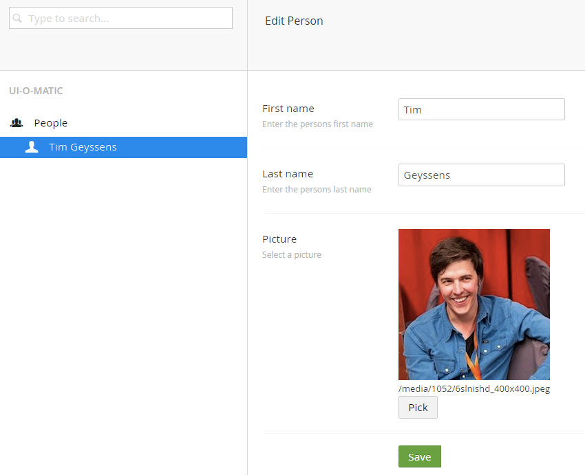

# Usage #

With a db table and a petapoco poco in place you'll have a couple of steps to follow. Important: your table **must have a primary key column** (and your poco must mark it with the **PrimaryKeyColumn** attribute)

## Decorate your class with the UIOMatic attribute ##

In order for UI-O-Matic to pick up your poco you'll have to mark it with the *UIOMatic* attribute

	[UIOMatic("people","People","Person")]

The UIOMatic attribute has a contructor with 3 parameters
	
- Alias gives the type an easily referenceable name for lookups by UI-O-Matic
- Folder name is displayed in the content tree and list view title (should be plural form)
- Item name is displayed in the editor view titles (should be singular form)

You can also specify additional parameters

- FolderIcon used for the main tree node
- ItemIcon used for the tree item nodes
- ParentAlias, if you wish this type to appear inside a folder then this should be set to the folders alias
- ConnectionStringName, if you wish to use a different db then the current Umbraco one
- RenderType, if you wish to render the items in a listview or in the tree
- SortColumn, the default sort column
- SortOrder, the order of the sord (asc or desc) 
- ReadOnly, setting this to true will remove create/update/delete options
- Order, sets the order in which this item should appear in the tree
- ShowOnSummaryDashboard, if you wish to show the count of items on the summary dashboard
- ListViewActions, actions that will be available on the list view

## Decorate properties with the UIOMaticField attribute ##

All fields you wish to be editable by UI-O-Matic must be decorated with the *UIOMaticField* attribute like so.

	 [UIOMaticField]

You can also specify additional parameters

- Name, name of the field (will be shown as the label for the field)
- Description, description of the field
- IsNameField, sets whether the given field should be treated as the name field and be displayed in the header section
- Tab, sets which tab this property should appear on
- TabOrder, sets the order of the tab in the tabs collection
- Order, sets the order in which this field will be displayed

Optionally it's also possible to specify a view

	[UIOMaticField(View = UIOMatic.Constants.FieldEditors.File)]

There are a couple out of the box views you can use

- checkbox
- checkboxlist (needs config)
- date
- datetime
- datetimeoffset
- dropdown (needs config)
- file
- list (needs config)
- label
- map (needs config)
- number
- password
- pickers.content
- pickers.media
- pickers.member
- pickers.user
- pickers.users
- radiobuttonlist (needs config)
- rte
- textarea
- textfield

Besides the out of the box ones you can also use a completely custom one 

 	[UIOMaticField(View = "~/App_Plugins/Example/picker.person.html")]

## Validation ##

UIOMatic will validate using the standard .net [data annotation](https://msdn.microsoft.com/en-us/library/system.componentmodel.dataannotations(v=vs.110).aspx), so you can just decorate your properties with those.

	[Required]
    public string FirstName { get; set; }

## Override the ToString method ##

UI-O-Matic will call the *ToString* method when it tries to fetch the tree item names, so make sure to override that one.

    public override string ToString()
    {
        return FirstName + " " + LastName;
    }

## Complete example ##
Here is a complete example that puts the different bits together.

    [UIOMatic("people", "People", "Person", FolderIcon = "icon-users", ItemIcon = "icon-user")]
    [TableName("People")]
    public class Person
    {
        [PrimaryKeyColumn(AutoIncrement = true)]
        public int Id { get; set; }

		[Required]
        [UIOMaticField(Name="First name", Description="Enter your firstname")]
        public string FirstName { get; set; }

		[Required]
        [UIOMaticField(Name="Last name", Description="Enter your lastname")]
        public string LastName { get; set; }

        [UIOMaticField(Name = "Picture", Description="Please select a picture",View =  UIOMatic.Constants.FieldEditors.File)]
        public string Picture { get; set; }

        public override string ToString()
        {
            return FirstName + " " + LastName;
        }
    }

## Result ##

