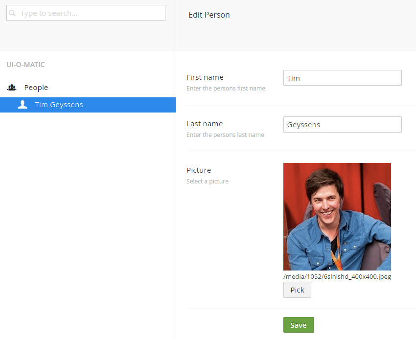

#  #

UI-O-Matic allows you to auto generate an integrated crud UI in Umbraco for a db table based on a [petapoco](http://www.toptensoftware.com/petapoco/) poco.

## How can I install it? ##
UI-O-Matic can be installed from the [Nuget package repository](https://www.nuget.org/packages/Nibble.Umbraco.UIOMatic/), or build manually from the [source-code](https://github.com/TimGeyssens/UIOMatic)

## Getting Started ##
Of course make sure that UI-O-Matic is installed, your user has access to the new UI-O-Matic section and then create your poco

### Example  ###
If you have the following db table

    CREATE TABLE [People] (
      [Id] int IDENTITY (1,1) NOT NULL
    , [FirstName] nvarchar(255) NOT NULL
    , [LastName] nvarchar(255) NOT NULL
    , [Picture] nvarchar(255) NOT NULL
    );

And the following petapoco poco

    [TableName("People")]
    public class Person
    {

        [PrimaryKeyColumn(AutoIncrement = true)]
        public int Id { get; set; }

        public string FirstName { get; set; }

        public string LastName { get; set; }

        public string Picture { get; set; }

    }

The next additions to the class (attributes)

    [UIOMaticAttribute("people","People","Person", FolderIcon = "icon-users", ItemIcon = "icon-user")]
    [TableName("People")]
    public class Person
    {
        [PrimaryKeyColumn(AutoIncrement = true)]
        public int Id { get; set; }

		[Required]
        [UIOMaticField(Name = "First name", Description = "Enter the persons first name")]
        public string FirstName { get; set; }

		[Required]	
        [UIOMaticField(Name = "Last name",Description = "Enter the persons last name")]
        public string LastName { get; set; }

        [UIOMaticField(Name = "Picture",Description = "Select a picture", View =  UIOMatic.Constants.FieldEditors.File)]
        public string Picture { get; set; }

        public override string ToString()
        {
            return FirstName + " " + LastName;
        }

    }

will generate the following crud UI

